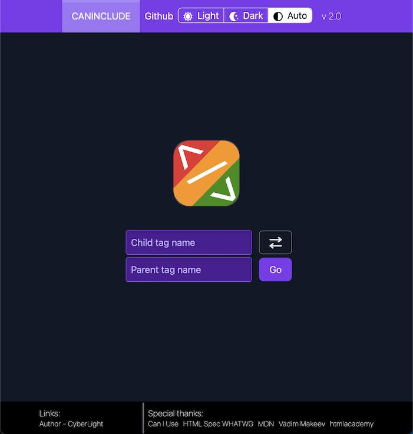

# Caninclude

## About
<div align="center">
    
</div>

Please, see **Demo** [here](https://caninclude.glitch.me)

This is the second generation of the caninclude service!

## Development environment
* [VSCode](https://code.visualstudio.com/)
* [VSCode Remote Containers](https://code.visualstudio.com/docs/remote/containers#_installation)
* Clone `git clone https://github.com/CyberLight/caninclude-v2`
* Go to cloned project repo folder `cd caninclude`
* Open in VSCode `code .`
* In popup menu click by `Reopen in Container`
* Whew!

## CLI Commands

``` bash
# serve web part with hot reload at localhost:8080 and api part on localhost:8081 
# with proxying traffic from /api to web /api to localhost:8081
npm run dev

# build for production with minification
npm run build

# test the production build locally
npm run serve

# launches linting of the whole project
npm run lint

# launches only api:dev server at localhost:8081
api:dev
```

For detailed explanation on how things work, checkout the [CLI Readme](https://github.com/developit/preact-cli/blob/master/README.md).